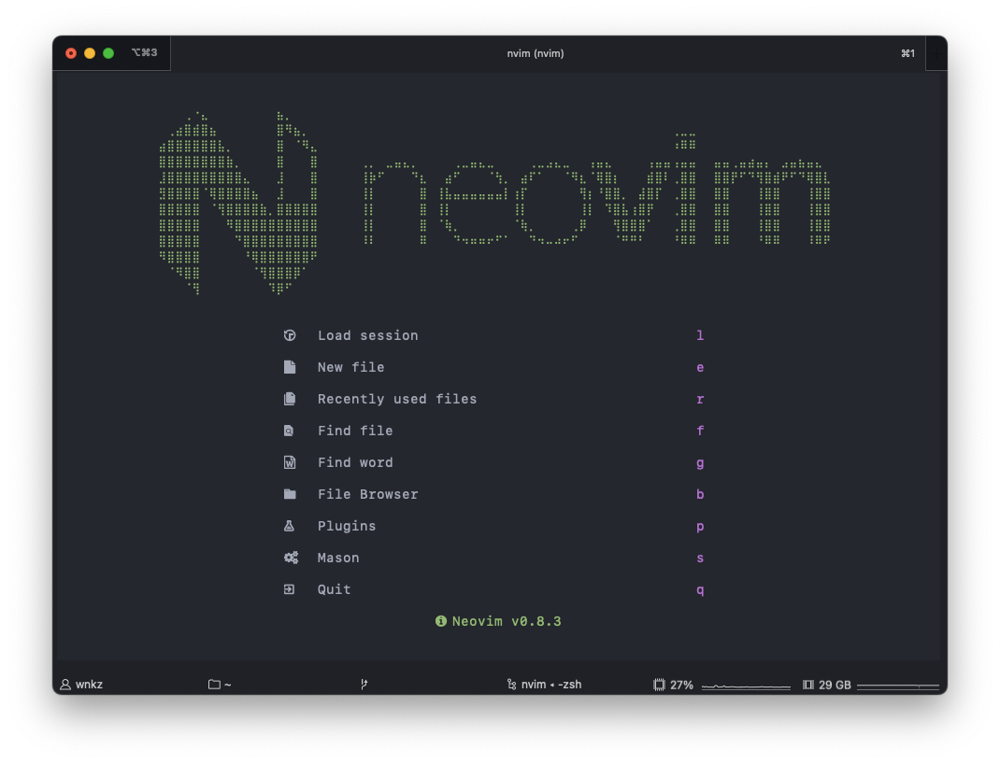

# neovim configuration



## ✨ Features

- 📦 Manage plugins with [lazy.nvim](https://github.com/folke/lazy.nvim) (`:Lazy`)

## ⚡️ Requirements

- Neovim >= **0.8.0** (needs to be built with **LuaJIT**)
- Git >= **2.19.0** (for partial clones support)
- a [Nerd Font](https://www.nerdfonts.com/) **_(optional)_**

## 🔎 FAQ / Misc.

### Generate a header for the dashboard

```sh
❯ chafa --invert -s 80 -c none --symbols braille static/neovim.png | while read -r i; do echo "\"$i\","; done
"⠀⠀⠀⢀⠐⣄⠀⠀⠀⠀⠀⠀⠀⠀⣦⡀⠀⠀⠀⠀⠀⠀⠀⠀⠀⠀⠀⠀⠀⠀⠀⠀⠀⠀⠀⠀⠀⠀⠀⠀⠀⠀⠀⠀⠀⠀⠀⠀⠀⠀⠀⠀⠀⠀⠀⠀⠀⠀⠀⠀⠀⠀⠀⠀⠀⠀⠀⠀⠀⠀⠀⠀⠀⠀⠀⠀⠀⠀⠀⠀",
"⠀⢀⣴⣿⣾⣿⣦⠀⠀⠀⠀⠀⠀⠀⣿⠻⣦⡀⠀⠀⠀⠀⠀⠀⠀⠀⠀⠀⠀⠀⠀⠀⠀⠀⠀⠀⠀⠀⠀⠀⠀⠀⠀⠀⠀⠀⠀⠀⠀⠀⠀⠀⠀⠀⠀⠀⠀⠀⠀⠀⠀⢀⣀⣀⠀⠀⠀⠀⠀⠀⠀⠀⠀⠀⠀⠀⠀⠀⠀⠀",
"⣴⣿⣿⣿⣿⣿⣿⣧⡀⠀⠀⠀⠀⠀⣿⠀⠈⠻⣄⠀⠀⠀⠀⠀⠀⠀⠀⠀⠀⠀⠀⠀⠀⠀⠀⠀⠀⠀⠀⠀⠀⠀⠀⠀⠀⠀⠀⠀⠀⠀⠀⠀⠀⠀⠀⠀⠀⠀⠀⠀⠀⠰⠿⠿⠀⠀⠀⠀⠀⠀⠀⠀⠀⠀⠀⠀⠀⠀⠀⠀",
"⣿⣿⣿⣿⣿⣿⣿⣿⣷⡀⠀⠀⠀⠀⣿⠀⠀⠀⣿⠀⠀⠀⠀⠀⢀⡀⠀⣀⣤⣄⡀⠀⠀⠀⠀⢀⣀⣤⣄⣀⠀⠀⠀⠀⢀⣀⣠⣄⣀⠀⠀⢠⣤⣄⠀⠀⠀⠀⢠⣤⣤⢠⣤⣤⠀⠀⣤⣤⢀⣤⣴⣤⡄⠀⣠⣤⣦⣤⣄⠀",
"⣸⣿⣿⣿⣿⣿⣿⣿⣿⣿⣄⠀⠀⠀⣸⠀⠀⠀⣿⠀⠀⠀⠀⠀⢸⡷⠋⠀⠀⠀⠙⣆⠀⠀⣴⠋⠀⠀⠀⠈⢳⡀⠀⣴⠏⠁⠀⠀⠈⠻⣆⠈⢿⣿⡆⠀⠀⠀⣾⣿⠇⢀⣿⣿⠀⠀⣿⣿⡟⠋⠙⢻⣿⣾⠟⠋⠙⢿⣿⣇",
"⣻⣿⣿⣿⣿⠈⢿⣿⣿⣿⣿⣦⠀⠀⣸⠀⠀⠀⣿⠀⠀⠀⠀⠀⢸⡇⠀⠀⠀⠀⠀⣿⠀⢸⣧⣤⣤⣤⣤⣤⣤⡇⢰⡏⠀⠀⠀⠀⠀⠀⢻⡆⠘⣿⣿⡀⠀⣼⣿⡏⠀⢀⣿⣿⠀⠀⣿⣿⠀⠀⠀⢸⣿⣿⠀⠀⠀⢸⣿⣿",
"⣿⣿⣿⣿⣿⠀⠈⢻⣿⣿⣿⣿⣷⡀⣿⣿⣿⣿⣿⠀⠀⠀⠀⠀⢸⡇⠀⠀⠀⠀⠀⣿⠀⢸⡇⠀⠀⠀⠀⠀⠀⠀⢸⡇⠀⠀⠀⠀⠀⠀⢸⡇⠀⠹⣿⣧⢰⣿⡟⠀⠀⢀⣿⣿⠀⠀⣿⣿⠀⠀⠀⢸⣿⣿⠀⠀⠀⢸⣿⣿",
"⣿⣿⣿⣿⣿⠀⠀⠀⠻⣿⣿⣿⣿⣿⣿⣿⣿⣿⣿⠀⠀⠀⠀⠀⢸⡇⠀⠀⠀⠀⠀⣿⠀⠈⢷⡀⠀⠀⠀⠀⠀⠀⠈⢷⡀⠀⠀⠀⠀⢀⡿⠀⠀⠀⢻⣿⣿⣿⠁⠀⠀⢀⣿⣿⠀⠀⣿⣿⠀⠀⠀⢸⣿⣿⠀⠀⠀⢸⣿⣿",
"⣿⣿⣿⣿⣿⠀⠀⠀⠀⠙⣿⣿⣿⣿⣿⣿⣿⣿⣿⠀⠀⠀⠀⠀⠸⠇⠀⠀⠀⠀⠀⠿⠀⠀⠀⠙⠲⠶⠶⠖⠋⠁⠀⠀⠙⠲⠤⠴⠖⠋⠀⠀⠀⠀⠈⠛⠛⠃⠀⠀⠀⠘⠿⠿⠀⠀⠿⠿⠀⠀⠀⠘⠿⠿⠀⠀⠀⠸⠿⠟",
"⠻⣿⣿⣿⣿⠀⠀⠀⠀⠀⠘⢿⣿⣿⣿⣿⣿⣿⠟⠀⠀⠀⠀⠀⠀⠀⠀⠀⠀⠀⠀⠀⠀⠀⠀⠀⠀⠀⠀⠀⠀⠀⠀⠀⠀⠀⠀⠀⠀⠀⠀⠀⠀⠀⠀⠀⠀⠀⠀⠀⠀⠀⠀⠀⠀⠀⠀⠀⠀⠀⠀⠀⠀⠀⠀⠀⠀⠀⠀⠀",
"⠀⠈⠻⣿⣿⠀⠀⠀⠀⠀⠀⠈⢻⣿⣿⣿⡿⠁⠀⠀⠀⠀⠀⠀⠀⠀⠀⠀⠀⠀⠀⠀⠀⠀⠀⠀⠀⠀⠀⠀⠀⠀⠀⠀⠀⠀⠀⠀⠀⠀⠀⠀⠀⠀⠀⠀⠀⠀⠀⠀⠀⠀⠀⠀⠀⠀⠀⠀⠀⠀⠀⠀⠀⠀⠀⠀⠀⠀⠀⠀",
"⠀⠀⠀⠈⢻⠀⠀⠀⠀⠀⠀⠀⠀⠹⡿⠋⠀⠀⠀⠀⠀⠀⠀⠀⠀⠀⠀⠀⠀⠀⠀⠀⠀⠀⠀⠀⠀⠀⠀⠀⠀⠀⠀⠀⠀⠀⠀⠀⠀⠀⠀⠀⠀⠀⠀⠀⠀⠀⠀⠀⠀⠀⠀⠀⠀⠀⠀⠀⠀⠀⠀⠀⠀⠀⠀⠀⠀⠀⠀⠀",
```
